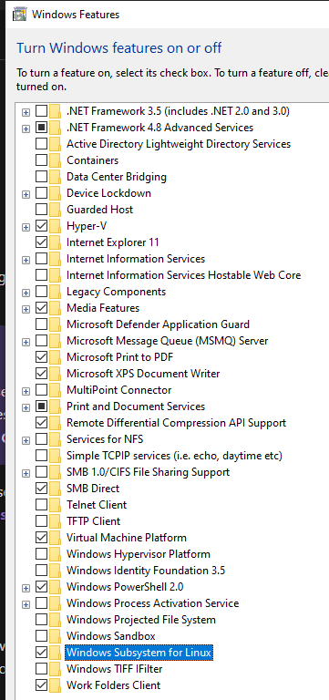
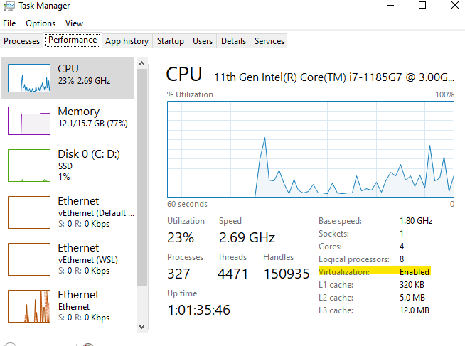

# Development-environment
Optimal Data Science environment setup. Idea is to have a seemless environment irrespective of which operating system you use. 

# Contents
- [WSL2](#wsl2)
- Python virtual environments
  - [venv](#virtual-environments-with-venv)
  - [Conda](#conda)
  - [Poetry](#poetry)
  
---
## WSL2
Windows Subsystem for Linux (WSL) lets you run a Linux environment inside of your Windows including most command-line tools, utilities, and applications. All this without the overhead of a traditional virtual machine or dual-boot setup.

[Here](https://docs.microsoft.com/en-us/learn/modules/get-started-with-windows-subsystem-for-linux/) is how you get started. 

### Prerequisites
Ensure to turn on these in Windows Features before installing WSL as shown below.
- 1. Virtual Machine Platfomr
- 2. Windows Subsystem for linux




If the virtual machine is disable in your system, then you need to enable it through Bios. Check here in Task manager. 




### Drives 
After installation you can verify the wsl version in powershell as 

```shell
wsl ---version
```

The Windows drives will be reflected in WSL as;
```
$ wsl/mnt/c 
```

### Pro tip
If you plan to work on wsl it is advisible to keep the files in wsl drive i.e `/home/user` instead of `/mnt/c` or `/mnt/d`
---

## Virtual Environments with `venv`
Installing a specific python version using `venv`

```shell
sudo apt install python3.8-venv    
```

Create a virtual environment with `venv`. 

```shell
python3 -m venv <envname>
```

Activate and deactivate the environment. 
```shell
source <venv>/bin/acivate

# to deactivate
deactivate
```
---
## Conda

```shell
wget https://repo.anaconda.com/miniconda/Miniconda3-py38_4.10.3-Linux-x86_64.sh

bash Miniconda3-<version>.sh
```

Update conda
```shell
conda update conda
```

Creating new environments
```shell
conda create --name <env name>

# activate environment
conda activate <env name>
```

Adding packages to conda
```shell
conda install numpy
```

```
### Install env with different python version. 
conda create --name condaenv python=3.8.10
```

Adding packages form environments `yaml`. 

A `yaml` file needs to be created first as described [here](https://docs.conda.io/projects/conda/en/latest/user-guide/tasks/manage-environments.html#create-env-file-manually)

```
conda env create -f environment.yml
```


For all commands refer [conda cheat sheet](https://docs.conda.io/projects/conda/en/latest/user-guide/cheatsheet.html)

---

## Poetry
Install poetry with `curl` and not by `pip`. 

```shell
curl -sSL https://raw.githubusercontent.com/python-poetry/poetry/master/get-poetry.py | python -
```

If python not found, replace it with `python3`
```shell
curl -sSL https://raw.githubusercontent.com/python-poetry/poetry/master/get-poetry.py | python3 -
```

